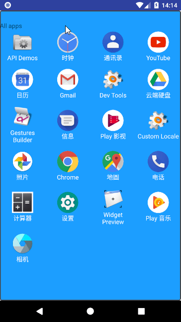

# KDroid 

[](https://github.com/7hens/KDroid/blob/master/LICENSE)
[](https://github.com/7hens/KDroid/blob/master/build.gradle)
[](https://github.com/7hens/KDroid/blob/master/build.gradle)
[](https://travis-ci.org/7hens/kdroid)

KDroid 是用 Kotlin 写的轻量级 Android 库。


<!-- maven { url 'https://dl.bintray.com/7hens/maven/' } -->

KDroid 目前有以下几个库：

- [core：快速开发框架](#core)
- [stetho-no-op：Stetho 的发布版](#stetho-no-op)
- [upay：调用微信支付、支付宝（Rx）](#upay)
- [vcs-revision：自动获取 VCS 的编译版本号](#vcs-revision)

<!--  -->

## core

在 module 的 build.gradle 中添加依赖：

[  ](https://bintray.com/7hens/maven/core/_latestVersion)

```groovy
implementation 'cn.thens.kdroid:core:0.1.10'
```

在 Application 里初始化：

```kotlin
KDroid.initialize(application, BuildConfig.DEBUG)
```

### Storage

Storage 用于数据存储，并提供了数据加解密，序列化，缓存等一系列相关功能，定制化十分方便。

```kotlin
val prefs = context.getSharedPreferences("main", Context.MODE_PRIVATE)
val asAes = AES("secrete".toByteArray()).toHexString().converse()

val node = prefs.toStorageNode("some_key")
    .codec(asAes)       // 通过AES加密
    .asJson<Person>()   // JSON序列化
    .cached()           // 使用数据缓存
    .rx()               // 使用RxJava

node.get().doOnSuccess { }.subscribe()
node.set(Person("Jack", "White")).subscribe()
node.remove().subscribe()
node.contains().subscribe()
```

### Logdog

```kotlin
Logdog.tag("@Http")
    .debug("debug message.")
    .warn("this is a warning.")
    .error("log the error message.")
    .count("name")
    .time("name")
    .memory()
    .trace()
```

### jBridge

jBridge 是一个十分轻量且安全的 Javascript Bridge，并在原生和 Web 端提供了一致的API和开发体验。

```kotlin
// for native (Kotlin)

val jBridge = JBridge.create(webView)

// 注册一个原生方法，供JS调用
jBridge.register("nativeMethod") { arg, callback ->
    callback("jsCallback")
}

// 调用JS的方法
jBridge.invoke("jsMethod", "jsArg") { arg -> }
```

```javascript
// for web (javascript)

// 注册一个JS方法，供原生调用
jBridge.register("jsMethod", function (arg, callback) {
    callback("nativeCallback")
})

// 调用原生方法
jBridge.invoke("nativeMethod", "nativeArg", function (arg) { })
```

### VAdapter

VAdapter 相关的类和 View 的对应关系。

| VAdapter | For View |
| ------- | --------- |
| `VRecyclerAdapter` | RecyclerView |
| `VListAdapter` | ListView, GridView, Spinner |
| `VPagerAdapter` | ViewPager |
| `VFragmentPagerAdater` | ViewPager |

这里以 VRecyclerAdapter 为例，其他的 Adapter 用法类似。

```kotlin
// 创建 VAdapter
val vAdapter = VRecyclerAdapter.create<YaData>(R.layout.view_item) { data, position ->
    vTitle.text = data.title
    vDescription.text = data.description
}

// 绑定 RecyclerView
recyclerView.layoutManager = LinearLayoutManager(context)
recyclerView.adapter = vAdapter

// 刷新数据
vAdapter.refill(dataSet)
```

创建 VAdapter 的另一种方法：

```kotlin
val vAdapter = object : VRecyclerAdapter<YaData>() {
    override fun createHolder(viewGroup: ViewGroup, viewType: Int): VAdapter.Holder<YaData> {
        return viewGroup.inflate(R.layout.view_item).toHolder { data, position ->
            vTitle.text = data.title
            vDescription.text = data.description
        }
    }
}
```

下面是 vadapter 库里面的几个主要类的继承关系图：

```plain
MutableList<D>
|-- VAdapter<D>
|   |-- VBaseAdapter<D>
|   |   |-- VListAdapter<D>
|   |   |-- VPagerAdaper<D>
|   |-- VRecyclerAdapter<D>
|-- VFragmentPagerAdapter
```

可以看到它们都继承了 MutableList。因此我们可以对 VAdapter 进行列表一样的增删改操作。但操作完成之后需要调用 VAdapter.notifyChanged() 来刷新视图。

下面是一个示例：

```kotlin
fun onFetchData(dataSet: List<YaData>) {
    vAdapter.addAll(dataSet)
    vAdapter.removeAt(0)
    vAdapter.notifyChanged()
}
```

> VAdapter.refill() 里面已经调用了 notifyChanged()，无需再次调用。

> 关于 RecyclerView 的 BUG：Inconsistency detected. Invalid item position。解决方案见 StackOverflow： [30220771](https://stackoverflow.com/questions/30220771/recyclerview-inconsistency-detected-invalid-item-position)，[31759171](https://stackoverflow.com/questions/31759171/recyclerview-and-java-lang-indexoutofboundsexception-inconsistency-detected-in)

### Moc

生产随机的 mock 数据。

**Moc 通过注解来表示要生成的随机数据，并通过调用 Moc.create() 来创建实例：**

```kotlin
data class YaData(
        @MocBool(false) val isFollowed: Boolean,
        @MocString("mockedTitle", "Celavee", "Balabala") val title: String,
        @MocString("cool", "too") val description: String,
        @MocString("dd", "ee", "tt") val detail: String
)

val data: YaData = Moc.create(YaData::class.java)
```

Moc 中含有的注解：
- MocBool：生成随机的 boolean
- MocString：生成随机的 String
- MocInt：生成随机的 int
- MocLong：生成随机的 long
- MocFloat：生成随机的 float
- MocDouble：生成随机的 double
- MocList：生存随机大小的 ArrayList

## stetho-no-op

Stetho 是一个调试工具，但官方并没有提供其发布版，于是我就补了一个。

在 module 的 build.gradle 中添加依赖

[  ](https://bintray.com/7hens/maven/stetho-no-op/_latestVersion)

```groovy
releaseImplementation "cn.thens.kdroid:sthetho-no-op:0.1.10"

debugImplementation "com.facebook.stetho:stetho:$stethoVersion"
debugImplementation "com.facebook.stetho:stetho-okhttp3:$stethoVersion"
```
## upay

UPay 是一个集合支付宝和微信支付的轻量级的工具库。

在 module 的 build.gradle 中添加依赖

[  ](https://bintray.com/7hens/maven/upay/_latestVersion)

```groovy
implementation "cn.thens.kdroid:upay:0.1.11"
```

### 支付宝支付

支付宝支付和微信支付是类似的，调用 pay() 都返回 `Observable<PayResult>`。

得到 PayResult 后，可以通过 code 的值来判断是否支付成功。
- `PayResult.SUCCESS` 支付成功
- `PayResult.CANCEL` 支付取消
- `PayResult.FAIL` 支付失败

```kotlin
fun alipay(orderInfo: String) {
    Alipay.pay(activity, orderInfo)
        .doOnNext { payResult ->
            if (payResult.code == PayResult.SUCCESS) {
            }
        }
        .subscribe()
}
```

### 微信支付

微信需要先在 Application 里初始化。

```kotlin
WeChatPay.initialize(this, appId)
```

微信支付流程和支付宝类似。

```kotlin
fun weChatPay(orderInfo: String) {
    WeChatPay.pay(activity, orderInfo)
        .doOnNext { payResult ->
            if (payResult.code == PayResult.SUCCESS) {
            }
        }
        .subscribe()
}
```

## vcs-revision

自动获取 VCS 的编译版本号，常用于设置 app 的 versionCode 值。

在根目录的 build.gradle 中添加依赖：

> VERSION: [  ](https://bintray.com/7hens/maven/vcs-revision-gradle-plugin/_latestVersion)

```groovy
buildscript {
    dependencies {
        classpath "cn.thens.kdroid:vcs-revision-gradle-plugin:$VERSION"
    }
}
```

修改 app 的 build.gradle：

```groovy
apply plugin: 'cn.thens.vcs-revision'

android {
    defaultConfig {
        versionCode vcsRevision
    }
}
```
